# 
ThinkSNS Plus直播服务器配置文档

## 概述

包括三个部分：

1. [直播系统服务端](#直播系统服务端)；
2. [ThinkSNS Plus服务端](#thinksnsplus服务端);
3. [直播IM系统](#直播IM系统)

推荐阅读此文档的目标群体

- 能够操作Linux操作系统的开发者

-----

### 直播系统服务端
&nbsp;&nbsp;&nbsp;&nbsp;&nbsp;&nbsp;&nbsp;直播系统服务端主要提供直播推拉流、回放等鉴权操作，是一套单独的系统，可以和ts+和im部署在同一台服务器，直播系统由`thinkphp5.0`提供框架服务，本文档只介绍安装部署过程；

1. 首先需要在[七牛](https://www.qiniu.com/)云服务申请账号，并通过企业认证，然后创建直播空间，创建直播空间的前提是需要你的域名在工信部以及公安部备案，工信部备案可以在购买服务器的IDC商处进行，比如[阿里云备案系统](https://beian.aliyun.com/)；然后[公安部备案](http://www.beian.gov.cn/portal/index.do),具体操作请按各个网站上的说明进行

	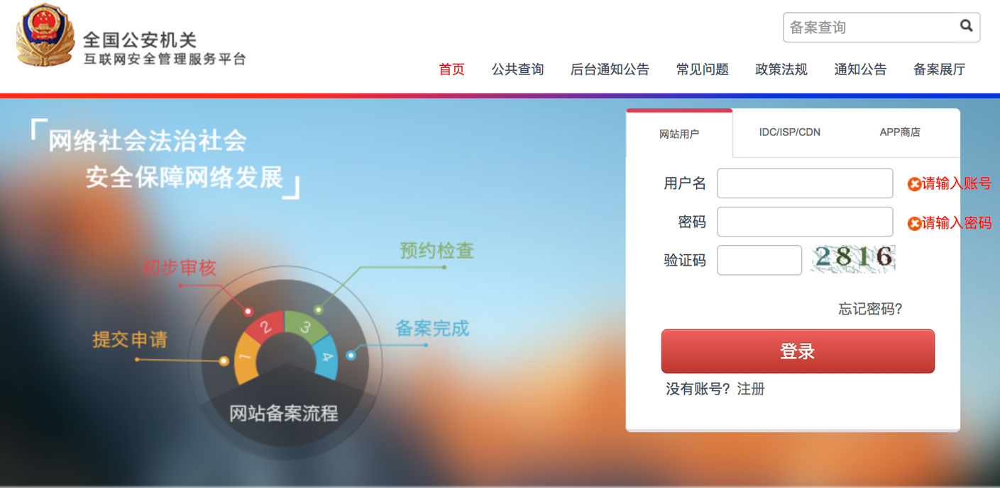

	> 上述的两个备案必须通过之后，才能接入七牛云进行直播空间开通

2. 直播空间创建，我们需要的是直播云服务

	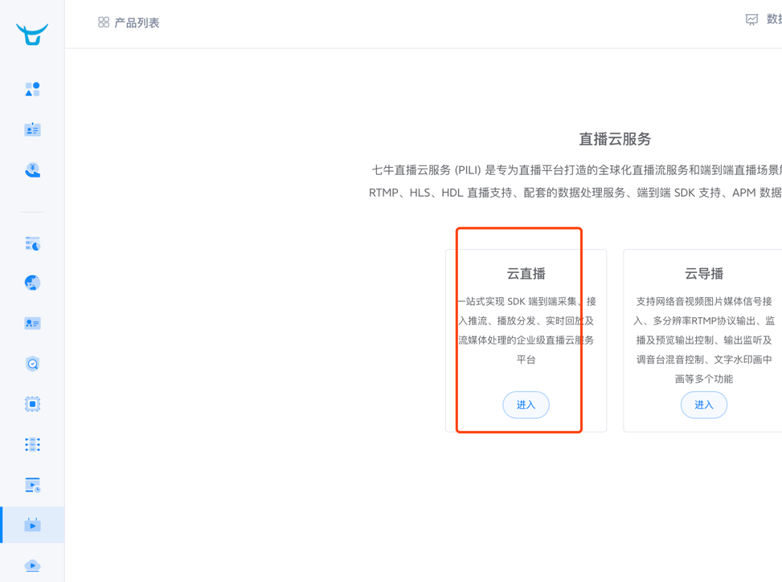
	请根据创建步骤一步一步创建，**域名绝对不要填错了，因为不可更改**
	
3. 【hub-name】空间创建成功之后，需要对几个默认需要的域名做cname解析

	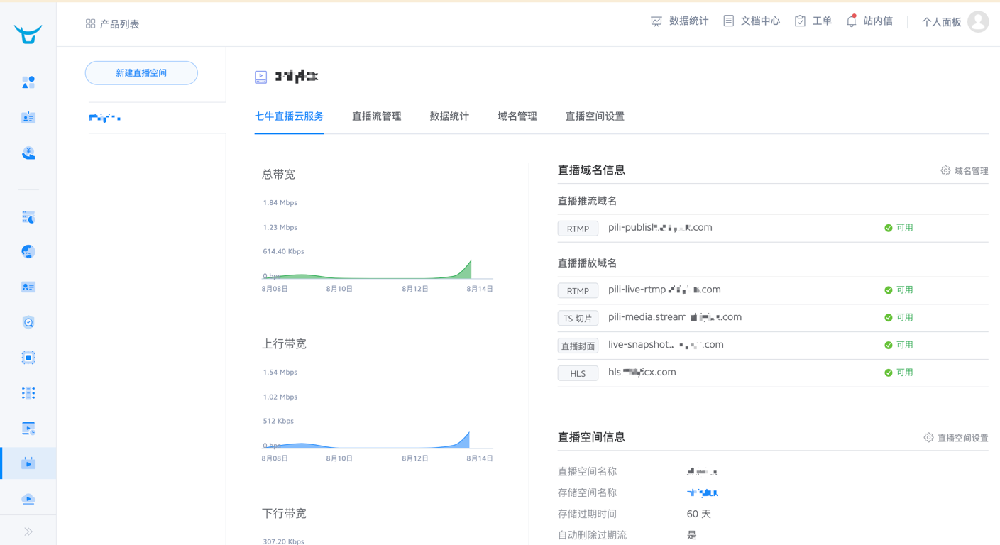
	
	大概就是上图右侧的几个域名，必须要做cname解析，否则无法使用，还需要增加一个域名的cname解析，是和h5端播放有关的，由于h5不支持rtmp协议，所以我们需要hls直播地址来观看，所以我们点击上图的【域名管理】菜单来添加一个域名用于hls播放
	
	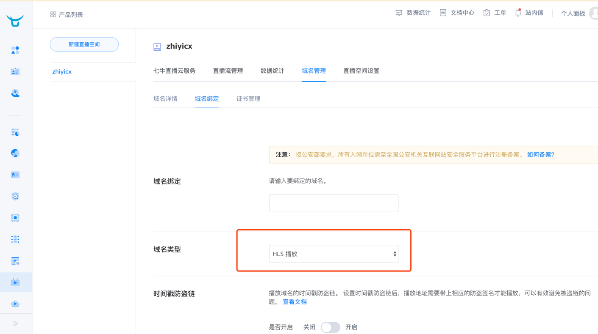
	
	最下方的时间戳防盗链可以填写，也可以不填写，这个看您的需求，区别就是会重新计算一个带有签名的直播地址，影响大，这个域名也要做cname解析，在本步骤第一张图中，右侧的域名如果cname没有成功的话，会有教你做cname解析的教程，由于账号只能申请一个，所以我们不便于做截图操作；如果有不明白的地方，可以直接联系七牛客服
	
4. 推流地址设置

	

	图中类型从上到下对应下文中要说到的配置文件的参数名分别为: 
	
	- hls -> hls-play, 
	- rtmp播放 -> rtmp-play, 
	- 直播封面->snap-shot，
	- RTMP推流-> rtmp-push,
 	- 第6点中的直播流处理列队-> pipeline
 	
	域名管理中，我们选定RTMP推流，然后点击管理，进入页面中，我们重点要配置直播状态通知，

	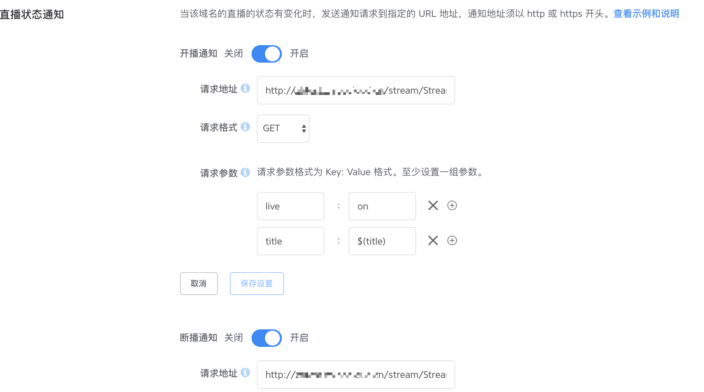
	
	 **开播通知和断播通知都要设置，否则系统无法正确接收到直播流的状态，从而导致直播数据混乱，请求的地址都是 domain/stream/Stream/statusBack, 请求格式为 GET, 参数为 live={on|off}, title=$(title), live为on时，表示开播，off表示断播，断播延时设置为5秒,其中 domain为你给直播系统分配的域名例如live.xxxx.com** 

5. 直播空间设置

	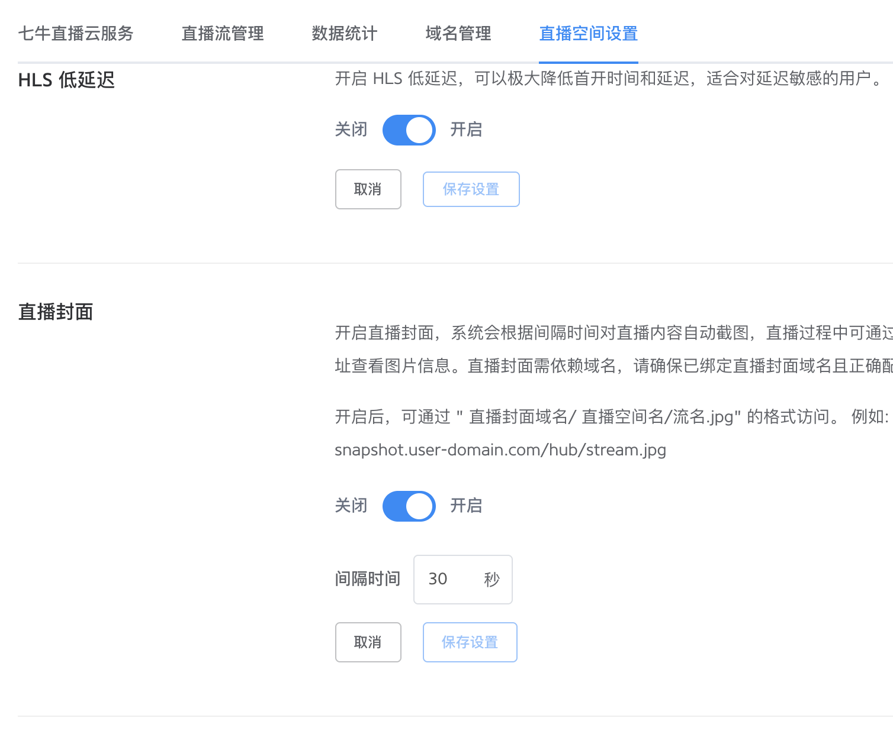
	
	请设置hls低延迟开启，以及直播封面开启，间隔时间可以自行决定，如果不开启直播封面，那在直播的时候没有手动上传封面的直播间，将没有封面图；
	
	 **然后页面往下，需要设置直播鉴权为限时鉴权，这个非常重要**
	
	至于其他的选项，可以自行设置

6. 直播流处理列队创建，也就是七牛登录后首页左侧菜单中的多媒体列队，这个可能会是在创建直播空间的时候已经创建了，如果没有的话，新建一个，
7. 直播服务器中的配置，首先修改配置文件位于`application/config.php`

	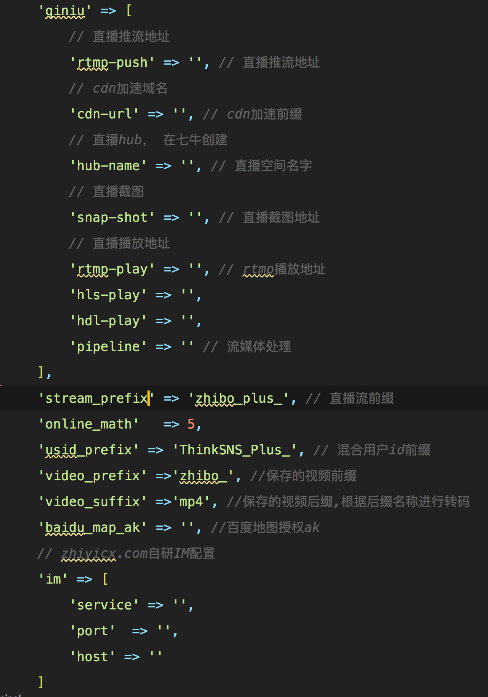
	
	我们要修改的只是这一段： qiniu中的部分，按照上述第4点的说明，一次填入对应的域名，`cdn`加速前缀这个比较特殊一点，在创建直播空间的时候，七牛会自动创建一个存储空间，用于存放直播过程中产生的一些文件，你可以为该存储空间绑定一个加速域名，也可以用七牛给你分配的域名，`cnd-url`就填存储空间的这个域名，请加上`http|https`前缀，
然后各种 `*_prefix` 就是和直播唯一标示有关的东西，可以填写一致的，辨识度高的短字符串,比如我们是`thinksns`官方，就可以填写`thinksns_`, 内容请用半角单引号包裹，`online_math`参数可以忽略，已弃用，`im`部分为自研`im`配置的地址，请看配置`im`的文档, `im`配置项中： `server`请加上协议`http|https`, `host`不用加协议；
8. 由于没有做安装界面，所以需要手动导入仓库代码中的`sql`文件，然后再`database.php`文件中填写正确的数据库信息，数据导入和配置`mysql`不做赘述
9. 修改导入`mysql`中的部分内容如图

	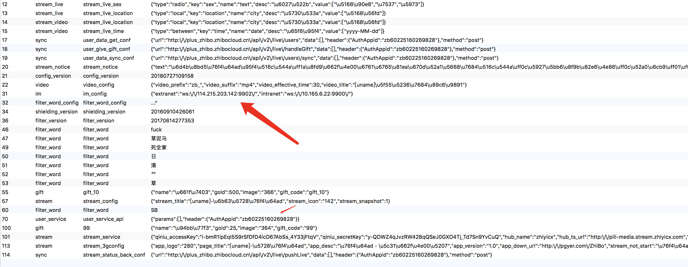
	
	此处需要修改的内容是 `TS+`和直播系统通信的一个握手密钥,在浏览器中访问你的`url`，账号密码： `admin123/admin123`
	
	
	
	进入接口配置，马赛克的部分就是ts+的访问地址，随便点击一个修改，进入修改，第一个红框中的地址，就是你点击对应修改按钮那一行的地址，然后加上`header`
	
	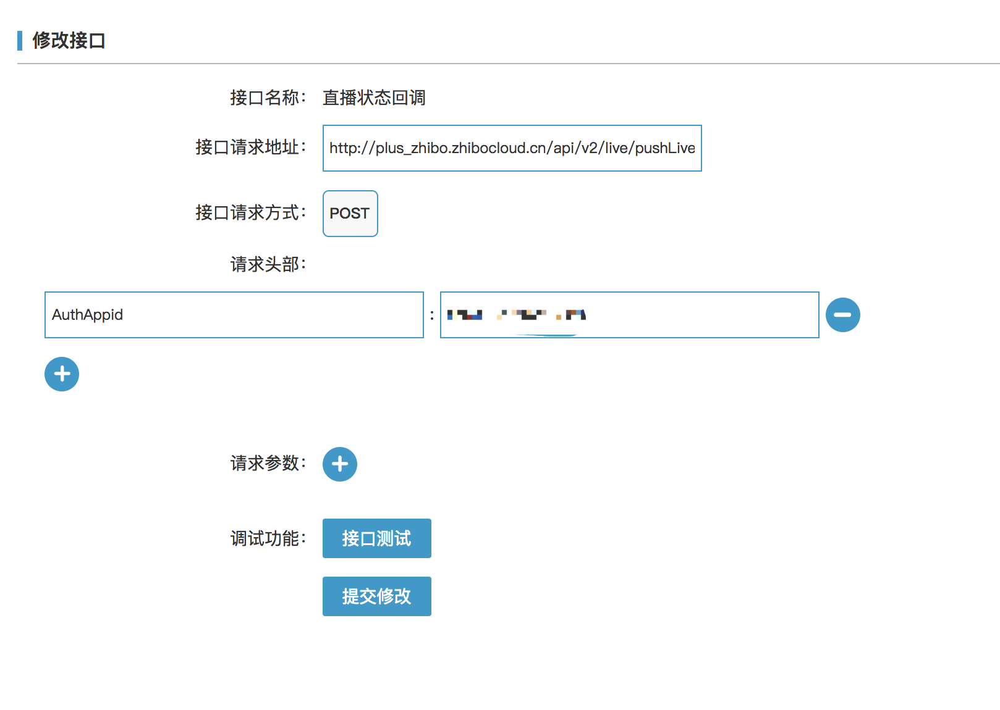
	
	请求头部的`AuthAppid`就是要在数据库中箭头处修改的内容，此内容可以自定义，但是！！**重点来了：： 所有的接口设置必须完全一致,因为这个值还需要到ts+中设置！ 每个接口都需要携带AuthAppid头部，这个是必须的**

	
	然后配置服务器，里面的内容都是和七牛有关的了，切片地址可以在七牛直播空间中找到；主要配置就讲解完毕；
	
10. 直播服务器中的配置百度地图key,否则移动端的直播位置信息将以经纬度的形式显示 ，修改配置文件位于`application/config.php`

	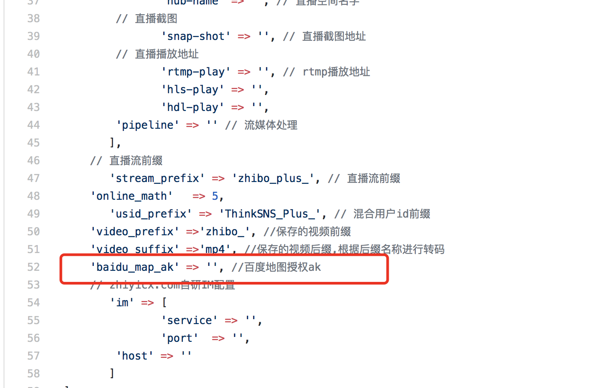

-----

## ThinkSNS Plus服务端
`TS+`服务器部署文档请查看[这里](../server/thinksnsPlusSimpleDeploymentDoc.md)

1. 在完成上述操作步骤之后，需要在`Ts+`中安装直播扩展，扩展安装过程请见TS+的用户手册，安装完后，需要做一个配置，就是之前我们说的，要和直播系统通信所必须携带的`header`头，此配置需要写入到`Ts+`根目录`/config/live.php`中

	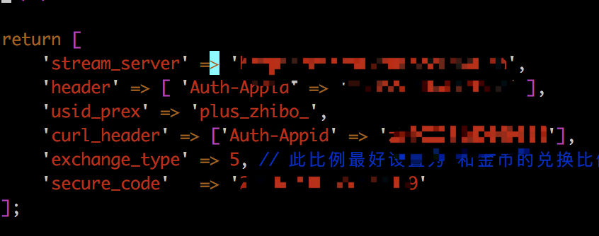
	
	
相关字段说明：

- `stream_server` 是你分配给直播系统的域名
- `header` 就是和直播系统中设置的header头一样了
- `used_prex` 和在直播配置文件中第7点中的`'usid_prefix' => 'ThinkSNS_Plus_'`设置一致
- `curl_header` 和需要和 `header` 一样
- `secure_code` 不用修改，保持原样
- 完后再`Ts+`根目录执行命令 `php artisan config:clear` 清理一下之前的配置缓存，然后配置完成

-----

## 直播IM系统

直播 `IM` 部署文档请查看[这里](./zhibo_im_config.md)

